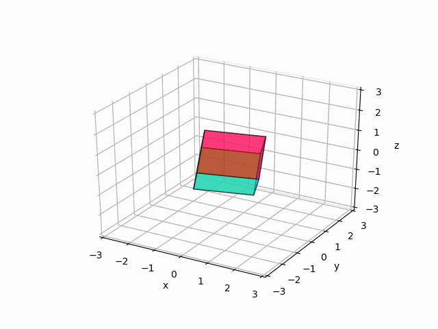

# Rotation Visualizer with Rotation Matrices and Quaternions

Mainly just a tool for me to learn and visualize rotation matrices and quaternions again.\
Done so by a small "reimplementation" of scipy.spatial.transform module or something very close to it (Also practice of classmethods and decorators)/

## Usage
To visualize a rotation run at the command line
```
sudo python3 cube.py -t 18 22 33 -t 75 16 32 -t 45 45 45
```
Note:
 - The numbers following the `-t` flag are euler angles. Calling the `-t` flag multiple times is permissible
 - `sudo` is needed to save a "cube_rotation.gif" file to your path that is an animation of the cube rotating like the following 



# TODO:
- [X] Add a visualiser to the Rotation class
- [X] Allow a sequence of rotations and able to input that sequence at the command line
- [ ] Display the rotation matrix or quaternion in the figure or anywhere more obvious beside terminal output
- [ ] Add sliders to increment/decrement the roll, pitch, yaw in the figure (May not do cause that eliminates the need to support quaternions)